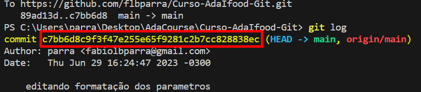

# Aprendizado de Git e GitHuB:
Nesse repositório irar encontrar parte do meu aprendizado, que venho retendo com cursos, esperiência e aprendizado durante a minha carreira com essa tecnológia. Logo abaixo está locais que passei que me deu experiências para essas anotações que venho fazendo. 

- Intituições:
  1. ADA TECH
  2. UNB
  3. ALURA
  4. CNJ

---
### Comandados GIT

``git add ".\nome arquivo"``:
* esse comando é bantante importante, aqui é como se tivesse upando alguma foto do seu projeto, antes de dar o commit (antes de comentar alguma coisa nos status e postar).

*Paramentros*:
* ``git add .``: Com esse ponto você envia todas as modificações que fez no repositório local. As vezes é bom quando está tudo concluído, porém ter um controle do que foi modificado, mandando apenas um arquivo por vez é bastante importante.

---

#### ``git diff ``:
* Esse comando serve para ver as alterações feitas no código ou nos blocos de textos, tantos as linhas que foram acrecentadas e retiradas.

*Parametros:*
* ``git diff --staged`` : Ápos o comando add não conseguimos ver o que foi alterado nas linhas, porém passando paretro "git diff --staged", conseguimos ver as linhas alteradas.

---

#### ``git commit``
* Esse comando serve para você salvar o estado das suas alterações, geralmente é feito quando se tem algo pronto. Dividindo assim o progresso em vários passos.

*Parametros*:
* ``git commit -m "testando commit"``: Com esse paramentro (um dos principais que você vai usar durante sua carreira) conseguimos comentar algo durante o commit para deixar um aviso do que foi feito naquele commit:
* ``git commit -a -m "testando commit``: Além de você poder dar commit também serve para subistuir o ``git add``, porém não funciona para criação de arquivos novos, só para edição dos que já existem.

---

#### ``git log``:
* Traz um histórico de commits do que foi editado. Assim você consegue ver o que já foi commitado e por quem (por isso é bom fazer os comentários com o parametro *-m*, para indicar o que está sendo atualizando e feito durante o projeto). Vai retorna uma hash que seria como um checksum.
   **_Hash:_**

_Parametros:_

---

``git restore ".\arquivo"``:
* Esse comando conseguimos restaurar o modo anterior do arquivo.

_Parametros:_
* ``git restore .``: Restaura todos tudo para o status anterior (para "hash" anterior).
* ``git restore --staged . or ".\arquivo"``: Volta todos para o status de modificado, tirando basicamente o que o ``git add .  or ".\arquivo"`` tinha feito antes.

---

``git restore .\teste.txt``:
* Serve para restaura uma mudanda em algum arquivo que você editou e salvou e não quer mais aquela mudança.
* _Parametros_:
  * ```git restore --staged```: Retorna para area de modificação apos dar ``git add .\arquivo.txt``, tira da área de postagem e volta para edição.
---
#### Repositório Remoto

####``git remote``:
* Mostra todos os repositórios remotos que estão prensentes na sua maquina local.
* _Parametros_:
  * ``git remote add "nome" "endeço"``: Adiciona um repositório remoto para enviar e baixar arquivos do projeto.

#### ``git push``:
* envia arquivos para repositório remoto.
  
#### ``git fetch``: 
* Busca todas as alterações feitas no repositório remoto e baixa elas, para você ver tem que usar o ``git diff``.

#### ``git pull``: 
* Baixa para seu reporitório local os arquivos do repositório remoto.
----

Fazer; Braches, merge, e procurar novos comandos para colocar aqui.

  
